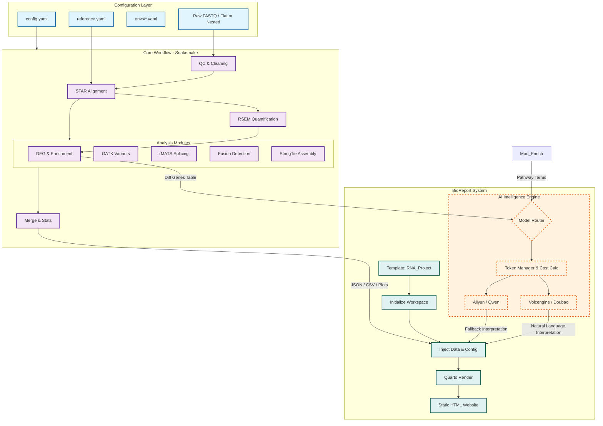

# RNAFlow - RNA-seq Analysis Pipeline

[中文版本 (Chinese Version)](doc/README_zh.md)

RNAFlow is a fully automated RNA-seq analysis pipeline based on Snakemake. It implements an end-to-end closed-loop analysis from **Raw Data** to **Standardized Bioinformatics Reports (Interactive Report)**, and finally to **AI-powered results interpretation**.


## 📖 Table of Contents
- [Core Features](#-core-features)
- [Analysis Workflow](#-analysis-workflow)
- [System Architecture](#-system-architecture)
- [BioReport System](#-bioreport-system)
- [Directory Structure](#-directory-structure)
- [Installation Guide](#-installation-guide)
- [AI Skills Usage Guide](#-ai-skills-usage-guide)
- [Configuration Guide](#-configuration-guide)
- [Usage Instructions](#-usage-instructions)
- [Development Roadmap](#-development-roadmap)
- [Version History](#-version-history)

## ✨ Core Features

- **High Scalability**: Supports distributed task scheduling, perfectly adapted to cluster environments (e.g., Slurm, PBS), enabling large-scale parallel sample processing.
- **Portability**: Automatically manages all toolchains via Conda/Mamba, ensuring complete consistency between code and environment for reproducible analysis and "painless" migration.
- **Modularity**: Based on Snakemake rules, analysis steps (QC, mapping, differential analysis, etc.) are logically decoupled, facilitating customized combinations and secondary development.
- **High Transparency**: Built-in full-process MD5 verification, execution status monitoring (Benchmark), and detailed logging system ensure the analysis process is traceable and data is auditable.
- **Real-time Monitoring**: Integrates Loki + Grafana monitoring system. Real-time workflow monitoring is achieved through the customized plugin `snakemake_logger_plugin_rich_loguru`, supporting structured log pushing and visual queries. (Note: The old Seq log monitoring solution has been deprecated).
- **Automated Reporting**: Driven by Quarto, it automatically aggregates multi-dimensional analysis results to generate professional bioinformatics reports containing dynamic charts (Plotly) and interactive tables.
- **AI-Powered Interpretation**: Integrates production-grade AI engines (e.g., Doubao, Qwen) to automatically transform complex differential genes and enrichment results into easy-to-understand biological insights.

## 🛠 Analysis Workflow

RNAFlow covers the standard whole process of transcriptome analysis:

1.  **QC & Cleaning**: FastQC quality control -> fastp filtering and adapter removal.
2.  **Contamination Check**: Detection of species contamination (FastQ Screen).
3.  **Mapping**: STAR high-performance alignment -> Qualimap/Samtools statistics -> Preseq library complexity / RSeQC integrity assessment.
    *   **STAR Parameter Optimization**:
        *   `--peOverlapNbasesMin 12`: Allows merging of paired-end reads when there is a 12bp overlap, significantly improving alignment accuracy for short-fragment libraries.
        *   `--peOverlapMMp 0.1`: Allows 10% mismatch in the overlap area, increasing the merging success rate in the presence of sequencing errors or SNPs.
        *   `--twopassMode Basic`: Enables two-pass mapping mode. Splice sites discovered in the first pass are used to guide the second pass, greatly improving the identification accuracy of junctions.
        *   `--outFilterMismatchNoverLmax 0.04`: Limits the mismatch rate to within 4% (only 6 mismatches allowed for 150bp), much stricter than the default 30%, effectively reducing false positive alignments.
        *   `--alignMatesGapMax 1000000`: Allows gaps up to 1Mb between paired-end reads, which is necessary for identifying long introns in eukaryotes.
        *   `--chimSegmentMin 12`: Sets the minimum segment length to 12bp, enabling STAR to search for and report cross-chromosomal fusion signals.
        *   `--quantMode TranscriptomeSAM`: Directly generates BAM files aligned to the transcriptome, facilitating subsequent quantification using RSEM or Salmon.
4.  **Quantification**: RSEM gene/transcript level expression quantification.
5.  **Advanced Analysis**:
    *   **DEG**: Differential expression analysis based on DESeq2.
    *   **Enrichment**: GO/KEGG functional enrichment analysis.
    *   **Splicing**: rMATS alternative splicing detection.
    *   **Fusion**: Arriba fusion gene identification.
    *   **Variants**: GATK single nucleotide variant detection.
    *   **Assembly**: StringTie transcript assembly.
6.  **Reporting & Delivery**: Automatically aggregates MultiQC, generates BioReport interactive reports, and organizes the delivery directory.

## 🏗️ System Architecture



### 🔄 Core Data Flow Description
1.  **Input Parsing**: `Snakemake` automatically reads `config.yaml` and identifies the input data structure.
2.  **Core Computation**: Expression matrices are obtained through STAR + RSEM, and advanced analysis modules are triggered in parallel.
3.  **Result Aggregation**: `15.deliver.smk` summarizes key results into the delivery directory.
4.  **Smart Reporting**: The `BioReport` system extracts analysis results and calls the AI engine for biological interpretation, finally generating a `Quarto HTML` report.

## 📊 BioReport System

**BioReport**, located in the `report/` directory, is the core highlight of this pipeline:

> [!WARNING]
> **Testing Note**: The AI smart interpretation module is currently in internal testing and has not yet been integrated into the final standardized reports.

*   **Architectural Concept**: Employs a "Copy-Inject-Render" pattern, dynamically injecting analysis results into Quarto templates.
*   **AI Engine**:
    *   **Multi-Cloud Architecture**: Supports Volcengine (Doubao) and Aliyun (Qwen).
    *   **High Availability**: Supports automatic API failover (Fallback).
    *   **Cost Control**: Built-in Token statistics and truncation strategies.
*   **Interactive Experience**: Reports feature responsive layouts, side navigation, and searchable interactive data tables.

Example report generated by BioReport:


## 📂 Project Organization Recommendations

To achieve decoupling of code and data, the following three-level directory structure is recommended for organizing analysis projects:

### 1. Top-level Project Directory
The root of the project, separating raw data, analysis processes, and final delivery:
```text
Project_Root/
├── 00.raw_data/             # Raw sequencer data (Read-only)
├── 01.workflow/             # Analysis workspace (Where Snakemake runs)
└── 02.data_deliver/         # Final result delivery directory (Automatically organized by the pipeline)
```

### 2. Analysis Working Directory (01.workflow)
Contains configuration files and serves as the current working directory for Snakemake:
```text
01.workflow/
├── config.yaml              # Project configuration (Specifies reference_path, etc.)
├── samples.csv              # Sample information table
├── contrasts.csv            # Differential analysis contrast table
├── 01.qc/                   # Intermediate QC results
├── 02.mapping/              # Intermediate alignment products (BAM, etc.)
├── 03.count/                # Intermediate quantification results
├── 07.AS/                   # Intermediate alternative splicing files
├── logs/                    # Detailed execution logs
└── benchmarks/              # Resource consumption statistics for each step
```

### 3. Result Delivery Directory (02.data_deliver)
Upon completion, the pipeline automatically summarizes core results here for final delivery:
```text
02.data_deliver/
├── 00_Raw_Data/             # Raw data summary
├── 01_QC/                   # QC reports (MultiQC, etc.)
├── 02_Mapping/              # Alignment statistical reports
├── 03_Expression/           # Expression quantification matrices
├── 05_DEG/                  # Differential expression analysis results
├── 06_Enrichments/          # Functional enrichment analysis charts
├── 07_AS/                   # Alternative splicing results
├── Summary/                 # Overall project summary statistics
├── Analysis_Report/         # Core Product: Final interactive web report entry
├── report_data/             # Data supporting the web report
└── delivery_manifest.json   # Delivery manifest and MD5 checksums
```

## 📂 Codebase Structure

```text
RNAFlow/
├── snakefile                # Main Snakemake entry file
├── config/                  # Configuration directory (Run parameters, reference genomes)
├── rules/                   # Modular rule definitions (00-15)
│   ├── 04.short_read_qc.smk # Quality control
│   ├── 07.mapping.smk      # Mapping
│   ├── 11.DEG_Enrichments.smk # Differential analysis and enrichment
│   ├── 15.deliver.smk      # Result organization
│   └── ...
├── envs/                    # Conda environment definition files (YAML)
├── report/                  # BioReport system source code
│   ├── bioreport/           # Report generation core logic
│   ├── templates/           # Quarto report templates
│   └── ai/                  # AI interpretation engine
├── skills/                  # AI Skills directory
│   ├── SKILL.md            # AI assistant skill definitions
│   ├── path_config.yaml    # Path configuration
│   ├── start_rnaflow.sh    # Enhanced startup script
│   ├── install_skills.sh   # General installation script
│   ├── install_codex_skills.sh # Codex-specific installation script
│   ├── examples/           # Configuration template examples
│   └── README.md           # Skills documentation
├── src/                     # Auxiliary script libraries (Python/R)
│   ├── DEG/                 # Differential analysis scripts
│   └── Enrichments/         # Enrichment analysis wrappers
└── scripts/                 # Utility scripts
```

## 🚀 Installation Guide

1.  **Clone the Repository**:
    > [!IMPORTANT] 
    > **Disclaimer**: RNAFlow is currently for internal use within the research group and has not been officially open-sourced.
    ```bash
    git clone --recurse-submodules git@github.com:xsx123123/RNAFlow.git
    cd RNAFlow
    ```

2.  **Environment Preparation**:
    Install Snakemake and Mamba:
    ```bash
    conda install -c conda-forge -c bioconda snakemake mamba
    ```

3. The pipeline uses conda environments for dependencies, which will be automatically created during execution.

4. **(Required for Monitoring) Install Enhanced Logger Plugin**:
   To enable beautiful console output, structured logging, and monitoring capabilities (as seen in the Usage examples), install the `snakemake_logger_plugin_rich_loguru` plugin (version 0.1.4):
   ```bash
   pip install snakemake_logger_plugin_rich_loguru==0.1.4
   ```
   > [!NOTE]
   > **Note**: This plugin is currently for internal use only and has not been publicly released.

## 🤖 AI Skills Usage Guide

RNAFlow provides dedicated AI Skills, allowing you to interact with AI programming assistants like Claude Code and Codex via natural language to easily complete RNA-seq analysis.

## 🔌 MCP Server Usage Guide

RNAFlow also provides an MCP server based on the [Model Context Protocol (MCP)](https://modelcontextprotocol.io/), using **[uv](https://docs.astral.sh/uv/)** for modern environment management.

### MCP Server Features

- **Genome Query**: List reference genomes supported by the system (read from `mcp_genome_version` in `config/reference.yaml`).
- **Configuration Generation**: Automatically generate `config.yaml`, `samples.csv`, and `contrasts.csv`.
- **System Resource Monitoring**: Real-time check of CPU, memory, and disk usage, with warnings before task submission.
- **Project Run Management**: Uses an SQLite database to record information for each run, supporting queries and statistics.
- **Project Conflict Detection**: Checks for project name conflicts before starting tasks to avoid duplication.
- **Asynchronous Execution**: Starts Snakemake in the background without blocking the AI.
- **Detailed Logs**: All operations are recorded in the `mcp/logs/mcp/` directory, with timestamps and detailed execution information.
- **Environment Isolation**: Uses `uv` to ensure that dependency libraries and analysis environments do not interfere with each other.
- **Dual Mode Support**: Local stdio mode + remote deployment capability.

### Prerequisites

Before using the MCP Server, ensure the following are installed on the server:
- Python 3.13+
- **uv (Package Manager)** - Must be installed on the server first
- conda/mamba (for running Snakemake)
- Node.js (Optional, for MCP Inspector testing)

### Install uv (if not installed)

```bash
curl -LsSf https://astral.sh/uv/install.sh | sh
```

### Quick Start

1. **Install MCP Dependencies**:
```bash
cd /home/zj/pipeline/RNAFlow/mcp
uv sync
```

2. **Optional: Install System Resource Monitoring Dependencies (Recommended)**:
```bash
uv add psutil
```

3. **Test Run**:
```bash
./start.sh test
```

### Usage in AI Clients

For detailed instructions and configuration methods, please refer to: `mcp/README.md`

- Local Usage Configuration
- Remote SSH Tunneling Configuration
- Production Deployment Plan

### 1. Install Skills
> NOTE: Due to the decoupled architecture of the analysis pipeline and skills, please modify the paths in the `path_config.yaml` file to your actual paths before installing skills. For example: `RNAFLOW_ROOT`, `complete`, `standard_deg`, etc.

RNAFlow Skills are located in the `skills/` directory and support automatic installation to Claude Code or Codex:

```bash
cd /home/zj/pipeline/RNAFlow/skills

# Auto-detect and install (Recommended)
./install_skills.sh

# Install specifically for Claude Code
./install_skills.sh

# Install specifically for Codex
./install_codex_skills.sh
```

### 2. Skills Content

After installation, your AI assistant will gain the following capabilities:

- **SKILL.md**: Complete RNAFlow usage instructions and workflow.
- **path_config.yaml**: Automatically configures the RNAFlow installation path.
- **start_rnaflow.sh**: Enhanced startup script, including:
  - Conda environment auto-detection
  - Snakemake availability verification
  - User confirmation mechanism
  - Complete analysis workflow

### 3. Usage Example

After successful installation, restart your AI assistant and interact via natural language:

```
"Help me set up an RNAFlow analysis project"
"Run RNAFlow's QC-only mode to check data quality"
"Use RNAFlow for differential gene expression analysis"
"Help me configure RNAFlow and run a full analysis" 
```

Example AI command for analysis:
"I have a batch of data in `/data/jzhang/project/Temp/rna_skills_analysis/00.raw_data`. Help me analyze it using RNAFlow skills. Use Lettuce v8 for the genome and perform only QC analysis. You can use the `activate_snakemake` `alias` command to activate the pre-configured Snakemake environment."

### 4. Enhanced Startup Script Features

`start_rnaflow.sh` provides a secure analysis startup process:

```
[1/5] Checking if conda is installed...
[2/5] Checking conda environments...
[3/5] Checking Snakemake in the environment...
[4/5] Environment summary, waiting for user confirmation...
[5/5] User confirmed activation of the environment...
```

### 5. Manual Installation (Alternative)

If the automatic installation script is not applicable, you can install manually:

**Claude Code**:
```bash
mkdir -p ~/.claude/skills/RNAFlow
cp -r skills/* ~/.claude/skills/RNAFlow/
chmod +x ~/.claude/skills/RNAFlow/start_rnaflow.sh
```

**Codex**:
```bash
mkdir -p ~/.codex/skills/RNAFlow
cp -r skills/* ~/.codex/skills/RNAFlow/
chmod +x ~/.codex/skills/RNAFlow/start_rnaflow.sh
```

### 6. More Information

For detailed installation and usage instructions, please refer to:
- `skills/INSTALL.md` - Complete installation guide
- `skills/usage-guide.md` - Usage guide
- `skills/README.md` - Skills documentation

## ⚙️ Configuration Guide

It is recommended to use external YAML configuration files to manage project parameters, achieving decoupling between code and configuration.

### Configuration Naming Convention

Starting from RNAFlow v0.1.9+, all configuration items uniformly use the **snake_case** (lowercase letters + underscores) naming convention to ensure consistency and readability.

| Old Config Name (Deprecated) | New Config Name (Recommended) | Description |
|----------------|---------------|------|
| `noval_Transcripts` | `detect_novel_transcripts` | Whether to detect novel transcripts |

**Core Configuration Naming Convention:**
```yaml
# Basic Switches (all snake_case)
only_qc: true                       # Run QC only
report: true                        # Generate HTML report
deg: true                           # Differential expression analysis
fastq_screen: true                  # FastQ Screen contamination check
call_variant: true                 # Variant calling
detect_novel_transcripts: true      # Novel transcript detection [Old: noval_Transcripts]
rmats: true                         # Alternative splicing analysis
```

**Notes:**
1. All configuration items use lowercase letters connected by underscores `_`.
2. Boolean configurations default to `false` (except for some core modules).
3. Configuration names should be consistent with the full English name or common abbreviation of the corresponding analysis module.

### 1. Configuration Example (config.yaml)
```yaml
project_name: 'PRJNA1224991'   # Project ID
Genome_Version: "Lsat_Salinas_v11" # Genome version (Supports: Lsat_Salinas_v8, Lsat_Salinas_v11, ITAG4.1, GRCm39, etc.)
species: 'Lsat Salinas'        # Species for analysis
client: 'Internal_Test'        # Client ID

# Raw data paths (Supports lists, can include multiple directories)
raw_data_path:
  - /path/to/raw_data

# Key information tables
sample_csv: /path/to/samples.csv    # Sample information table (format below)
paired_csv: /path/to/contrasts.csv  # Sample pairing/contrast info table (format below)

# Path settings
workflow: /path/to/analysis_dir     # Data analysis process directory (Workspace)
data_deliver: /path/to/deliver_dir  # Final result delivery directory

# Run parameters
execution_mode: local               # Run mode: local or cluster
# queue_id: fat_x86                 # Cluster queue name (Only valid in cluster mode), remove if not running on a cluster

# Sequencing library settings
Library_Types: fr-firststrand       # Strand-specificity type (fr-unstranded, fr-firststrand, fr-secondstrand)
                                    # The pipeline will automatically detect and compare settings; warnings will be issued if mismatched.

# Advanced analysis switches (All module switches use snake_case)
# Note: These are Boolean switches controlling the execution of each module.
# - true: Execute the module
# - false: Skip the module
call_variant: true                  # Whether to perform variant calling (GATK)
detect_novel_transcripts: true      # Whether to perform novel transcript assembly (StringTie) [Old: noval_Transcripts]
rmats: true                         # Whether to perform alternative splicing analysis (rMATS)
deg: true                           # Whether to perform differential expression analysis (DESeq2)
fastq_screen: true                  # Whether to perform contamination check (FastQ Screen)
report: true                        # Whether to generate HTML report

# Optional Configuration
only_qc: true                       # Run mode: qc_only (Only QC), if true skips all downstream analysis

# Monitoring Configuration
loki_url: "http://122.205.67.97:3100"  # Loki server address (for workflow monitoring)
```

### 2. Sample Information Table (sample_csv)
CSV format, containing three columns: `sample` (raw file name keyword), `sample_name` (renamed name), and `group` (grouping):
```csv
sample,sample_name,group
L1MKL2302060-CKX2_23_15_1,CKX2_1,CKX2
L1MKL2302061-CKX2_23_15_2,CKX2_2,CKX2
L1MKL2302062-CKX2_23_15_3,CKX2_3,CKX2
L1MKL2302063-Wo408_1,Wo408_1,Wo408
L1MKL2302064-Wo408_2,Wo408_2,Wo408
L1MKL2302065-Wo408_3,Wo408_3,Wo408
```

### 3. Sample Pairing Information Table (paired_csv)
Used for contrast settings in differential analysis (DEG), containing `Control` and `Treat` columns:
```csv
Control,Treat
Wo408,CKX2
```

### 4. Core Pipeline Configurations (Internal Configs)
Besides project-specific configs, the `config/` directory contains default settings:
- **`config/config.yaml`**: Basic global configurations of the pipeline.
- **`config/reference.yaml`**: Core reference genome configurations. Defines FASTA, GTF, and index paths for various versions (V8, V11, GRCm39, etc.).
  - **Pipeline Migration**: If running in a different environment, modify `reference_path` (e.g., `reference_path: /data/jzhang/reference/RNAFlow_reference`).
  - **Adding Genomes**: To support new species, add configurations in this file following the format.
  - **Automatic Check**: The pipeline automatically checks reference file integrity upon startup to ensure reliable analysis.
  - **FastQ Screen Database**: Added `fastq_screen_db_path`, pointing to the root directory of the contamination source database (must include subdirectories like hg38, GRCm39, fastq_screen_database). For migration, simply copy the directory and update the path in the configuration.
- **`config/run_parameter.yaml`**: Tool execution parameter settings, including specific command-line parameters for various software (e.g., STAR alignment thresholds, RSEM model parameters).
  - **STAR Parameter Details**:
    - `--peOverlapNbasesMin 12` (Current) vs `0` (Default): PE Overlap merging enabled.
    - `--peOverlapMMp 0.1` (Current) vs `0.01` (Default): Merging mismatch tolerance relaxed.
    - `--twopassMode Basic` (Current) vs `None` (Default): Two-pass mapping enabled.
    - `--outFilterMismatchNoverLmax 0.04` (Current) vs `0.3` (Default): Mismatch filtering strengthened.
    - `--alignMatesGapMax 1000000` (Current) vs `0` (Default): Cross-intron long gap alignment enabled.
    - `--chimSegmentMin 12` (Current) vs `0` (Default): Chimeric/fusion gene detection enabled.
    - `--quantMode TranscriptomeSAM` (Current) vs `None` (Default): Transcriptome quantification output enabled.
- **`config/cluster_config.yaml`**: Cluster resource definitions, specifying thread and memory allocations for different tasks (Low, Medium, High resource).

### 5. Loki + Grafana Monitoring Configuration (Optional)
RNAFlow supports real-time workflow monitoring via Loki + Grafana. All logs are structured and pushed to a Loki server for visualization in Grafana:

- **Configuration Parameters**:
  - Add the `loki_url` field in `config.yaml` to specify the Loki server address:
    ```yaml
    loki_url: "http://122.205.67.97:3100"  # Loki server address
    ```

- **Usage**: Add the `--logger rich-loguru` parameter when running Snakemake to enable the logging plugin:
  ```bash
  snakemake --cores 60 --use-conda --conda-frontend mamba \
            --logger rich-loguru \
            --config analysisyaml=path/to/your_config.yaml
  ```

- **Viewing Monitoring**: In Grafana, you can query and monitor logs as follows:
  - Access the Grafana interface and import pre-set monitoring dashboards.
  - View the following example screenshot for monitoring effects:


> [!NOTE]
> **Note**: This monitoring feature requires version 0.1.4 of the `snakemake_logger_plugin_rich_loguru` plugin.

### 6. Cluster Configuration (Optional)
If `execution_mode` is set to `cluster`, ensure related cluster plugins are installed (e.g., `snakemake-executor-plugin-slurm`). Finer resource allocation (threads, memory) can be edited in `config/cluster_config.yaml`.

## 💻 Usage Instructions

### Standard Analysis Workflow

RNAFlow manages project parameters through external YAML configuration files, achieving decoupling between code and configuration.

#### 1. Configuration Preparation (config.yaml)

Create a project configuration file and configure analysis module switches:

```yaml
# === Basic Project Info ===
project_name: 'PRJNA1224991'
Genome_Version: "Lsat_Salinas_v11"
species: 'Lsat Salinas'
client: 'Internal_Test'

# === Data Paths ===
raw_data_path:
  - /path/to/raw_data
sample_csv: /path/to/samples.csv
paired_csv: /path/to/contrasts.csv
workflow: /path/to/analysis_dir
data_deliver: /path/to/deliver_dir

# === Run Parameters ===
execution_mode: local
Library_Types: fr-firststrand

# === Analysis Module Switches (all snake_case) ===
only_qc: false              # Run QC only (skips all downstream analysis if true)
deg: true                   # Differential expression analysis
call_variant: true        # Variant calling
detect_novel_transcripts: true  # Novel transcript detection (formerly noval_Transcripts)
rmats: true                 # Alternative splicing analysis
fastq_screen: true          # Contamination check
report: true                # Generate HTML report

# Monitoring config (Optional)
loki_url: "http://your-loki-server:3100"
```

#### 2. Running the Analysis Pipeline

```bash
# 1) Dry Run check
snakemake -n \
    --config analysisyaml=/path/to/your_config.yaml

# 2) Execute analysis (Recommended parameters)
snakemake \
    --cores=60 \                           # Use 60 cores
    -p \                                   # Print shell commands
    --conda-frontend=mamba \              # Use mamba to manage conda environments
    --use-conda \                          # Automatically create/use conda environments
    --rerun-triggers mtime \              # Rerun based on modification time
    --logger rich-loguru \                # Use rich-loguru for colored logs
    --config analysisyaml=/path/to/your_config.yaml
```

#### 3. Configuration Item Description

| Config Item | Type | Default | Description |
|-------|------|-------|------|
| `only_qc` | bool | false | QC only mode, skips downstream analysis like DEG, variant calling, etc. if true. |
| `deg` | bool | true | Differential expression analysis (DESeq2) |
| `call_variant` | bool | false | Variant calling (GATK) |
| `detect_novel_transcripts` | bool | false | Novel transcript detection (StringTie), formerly `noval_Transcripts` |
| `rmats` | bool | true | Alternative splicing analysis (rMATS) |
| `fastq_screen` | bool | true | Contamination check (FastQ Screen) |
| `report` | bool | true | Generate interactive HTML report |

---

### Detailed Post-Configuration Analysis Content

Based on the settings in `config.yaml`, RNAFlow automatically decides which modules to run. Here are details for when items are enabled/disabled:

#### 📊 Basic Analysis (Always Runs)
Regardless of configuration, these modules **always execute**:

| Step | Tool | Output Content |
|------|------|---------|
| **MD5 Check** | md5sum | Raw data integrity verification report |
| **Quality Control (QC)** | FastQC, fastp | Sequencing data quality reports, filtered clean data |
| **Mapping** | STAR | Aligned BAM files, mapping statistics, Qualimap report |
| **Quantification (Count)** | RSEM | Gene/transcript expression levels (TPM/FPKM/Counts) |
| **CRAM Compression** | samtools | Compressed storage in CRAM format |

#### 🎛️ Optional Analysis Modules (Configuration Controlled)

##### 1️⃣ `only_qc: true` (QC Only Mode)
- **Effect**: Runs only basic QC and mapping, **skipping all downstream analysis**.
- **Use Case**: Data screening, rapid quality assessment.
- **Skipped Content**: DEG, variant calling, alternative splicing, novel transcripts, etc.

##### 2️⃣ `fastq_screen: true` (Contamination Check)
- **Tool**: FastQ Screen
- **Output**:
  - Contamination screening reports for R1/R2 of each sample.
  - MultiQC summary report.
- **Purpose**: Detects if samples are contaminated with exogenous species.

##### 3️⃣ `deg: true` (Differential Expression Analysis)
- **Tool**: DESeq2
- **Output**:
  - Differential gene lists for each contrast group (Excel/CSV).
  - Visualizations like volcano plots, MA plots, heatmaps, etc.
  - Gene expression distribution plots.
- **Dependency**: Requires correct setup of the `paired_csv` contrast table.

##### 4️⃣ `call_variant: true` (Variant Calling)
- **Tool**: GATK HaplotypeCaller
- **Output**:
  - Variant VCF files for each sample.
  - bcftools statistical reports.
  - MultiQC summary.
- **Application**: SNP/Indel detection in RNA-seq data.

##### 5️⃣ `detect_novel_transcripts: true` (Novel Transcript Detection)
- **Tool**: StringTie
- **Output**:
  - Novel transcript GTF files.
  - Filtered lists of new isoforms.
- **Old Config Name**: `noval_Transcripts` (Deprecated).

##### 6️⃣ `rmats: true` (Alternative Splicing Analysis)
- **Tool**: rMATS
- **Output**:
  - MATS results for 5 types of splicing events (SE, MXE, etc.).
  - Summary statistical reports.
  - Single sample and paired contrast results.
- **Additional**: Includes junction_annotation and CIRCexplorer2 (circRNA) analysis.

##### 7️⃣ `report: true` (Interactive Report)
- **Tool**: BioReport (Quarto + Docker)
- **Output**:
  - Interactive HTML report (`Analysis_Report/index.html`).
  - Visualizations for all modules.
  - AI biological interpretation (if configured).
- **Note**: Requires Docker environment and report data directory.

##### 8️⃣ `gene_fusion: true` (Gene Fusion Detection)
- **Tool**: Arriba
- **Output**:
  - Fusion gene TSV results for each sample (`{sample}_fusions.tsv`).
  - Discarded fusion results (`{sample}_fusions.discarded.tsv`).
  - Optional PDF visualization reports.
- **Application**: Detects inter-chromosomal fusion events, common in cancer research.

---

#### 📋 Typical Configuration Scenarios

**Scenario 1: Full Analysis (Recommended Default)**
```yaml
only_qc: false
deg: true
call_variant: true
detect_novel_transcripts: true
rmats: true
fastq_screen: true
report: true
```

**Scenario 2: Rapid QC Screening**
```yaml
only_qc: true  # Runs only QC and mapping
```

**Scenario 3: Standard Analysis Only (Skips Time-Consuming Modules)**
```yaml
only_qc: false
deg: true
call_variant: false      # Skips variant calling
detect_novel_transcripts: false  # Skips novel transcripts
rmats: false             # Skips alternative splicing
report: true
```

### Generating AI Reports (BioReport)

`RNAFlow` achieves deep integration of analysis and reporting. Report generation tasks are built into the `15.Report.smk` rule and will be **automatically triggered** after the main analysis completes.

#### 1. Automatic Integration Mode (Recommended)
When running standard analysis commands, the pipeline automatically collects results from all modules and calls BioReport to generate the final HTML report:
```bash
# Full workflow, reports generated in data_deliver/Analysis_Report
snakemake --cores 60 --use-conda --config analysisyaml=config.yaml
```

#### 2. Independent Operation Mode (Modular Call)
The report module can also be used as an independent tool, facilitating re-rendering or AI interpretation on existing data. Using a Docker image is recommended:

> [!NOTE]
> **Note**: The Docker image is currently for internal use only. Please contact developers for access or more info.

```bash
docker run -it --rm \
  --user $(id -u):$(id -g) \
  -v /path/to/analysis_data:/data:rw \
  -v /path/to/project_summary.json:/app/project_summary.json:rw \
  -v /path/to/output_report:/workspace:rw \
  bioreportrna:v0.0.5
```
**Parameter Descriptions:**
- `-v ...:/data`: Mounts the data directory from upstream analysis.
- `-v ...:/app/project_summary.json`: Mounts the project summary configuration.
- `-v ...:/workspace`: Mounts the report output directory.

#### 3. Manual Generation via Command Line
If the environment is configured locally, navigate to the `report` directory and run:
```bash
python report/bioreport/main.py --input results_dir --output report_dir --ai
```

## 📅 Development Roadmap

### v0.1.9 Iteration Targets
- **Dynamic Web Report Generation**: 
    - Implement dynamic generation of web reports for different workflows and modules.
    - **Implementation Logic**:
        1. **Module State Awareness**: Records states of `DEG`, `rMATS`, `Variant`, etc., in `project_summary.json`.
        2. **Dynamic Navigation Construction**: Before Quarto rendering, a Python script dynamically generates `_quarto.yml` based on module states, automatically hiding tabs for unrun analyses.
        3. **Conditional Content Rendering**: Uses Python logic within `.qmd` templates to achieve dynamic loading and display of result chapters.

- **WGCNA (Weighted Gene Co-expression Network Analysis)**: 
    - Implement gene module clustering and phenotype association analysis to identify core Hub Genes.
    - Export network files for Cytoscape visualization.
- **GSVA (Gene Set Variation Analysis)**: 
    - Calculate pathway activity scores for each sample, enabling differential analysis and visualization (heatmaps/correlations) of pathways.
- **TF Regulatory Network Prediction (Transcription Factor)**:
    - Integrate **PlantRegMap / PlantTFDB** for plants (e.g., Lettuce) to predict upstream transcription factor regulatory logic of differential genes.
- **Cellular Deconvolution**:
    - Introduce CIBERSORTx/MuSiC algorithms using single-cell reference sets to parse cell type proportions in tissue samples.

### v0.2.0 Iteration Targets
- **LncRNA Prediction and Analysis**:
    - Integrate CPAT/CPC2/LncFinder to identify novel LncRNAs and construct LncRNA-mRNA co-expression networks.
- **Cloud-Native Reference Management**:
    - Adopt **BYOC (Bring Your Own Cloud)** strategy, empowering users to build their own biological data centers for "Stateless Portability".
    - **Reference Factory**: Provides an independent Snakemake build process, supporting automatic synchronization to S3/OSS/MinIO.

### Advanced Experimental Design Modules
- To support more complex experimental designs (e.g., time-series analysis, two-factor interactions), the DEG module is planned for refactoring to support custom design formulas (`design_formula`).

### AI Engine Enhancements
Further enhance AI's capabilities in bioinformatics analysis:

1.  **Multimodal Analysis**: Combine multiple data types like gene expression, variants, and splicing for comprehensive biological explanations.
2.  **Real-time Learning**: Introduce online learning mechanisms for AI models to continuously update knowledge bases with the latest literature.
3.  **Personalized Interpretation**: Generate customized analysis report content based on users' professional backgrounds and research interests.

## 📈 Version History

### RNAFlow_v0.1.9
- **Optimization**: Fixed potential bugs in `call variant`, `enrichments`, and `report` modules.
- **Optimization**: Optimized `reference.yaml` and added `deg_enrich_wrapper` and `ploidy_setting` configs.
- **Debug**: Fixed missing `ref_all` config for `Lsat_Salinas_v8` reference.
- **Optimization**: Reverted `STAR` parameters to defaults.
- **Debug**: Fixed version inconsistency in `snakefile` (v0.1.7 -> v0.1.9).
- **Critical Debug**: Fixed spelling error in STAR index file " Genome" in `judge_star_index` function (extra space).
- **Debug**: Fixed issue in `01.common.smk` where config parameters were not passed during mapping function calls.
- **Optimization**: Updated `config.schema.yaml`, adding hg38 to the Genome_Version enum list.
- **Optimization**: Improved `config.schema.yaml` verification, adding missing config items like loki_url, only_qc, bam_remove, etc.
- **Optimization**: Added missing `ref_all` fields for `TAIR10.1` and `hg38` reference genomes.
- **Cleanup**: Removed duplicate `fastq-screen.yaml` in the `envs/` directory.

### RNAFlow_v0.1.8
- **Feature**: Deprecated the old Seq log monitoring, updated to Loki + Grafana.
- **Feature**: Added `loki_url` config for Loki server address.
- **Feature**: Updated `snakemake_logger_plugin_rich_loguru` to 0.1.4 for Loki log pushing.
- **Documentation**: Added Grafana monitoring example screenshot (see `doc/grafana.png`).
- **Feature**: Added `compress_bg` module for compressing STAR `coverage` files.

### RNAFlow_v0.1.7
- **Feature**: Added `estimate_library_complexity` rule.
- **Feature**: Added `rmats_summary` for merging AS results from paired and single samples.
- **Improvement**: Used `temp()` to mark intermediate BAMs for removal; added `bam2cram` rule to reduce storage overhead.
- **Feature**: Added `CIRCexplorer2_run` for circRNA detection.
- **Feature**: Added `geneBody_coverage` for library coverage assessment.
- **Feature**: Added `read_distribution` for library read distribution detection.
- **Feature**: Integrated customized plugin `snakemake_logger_plugin_rich_loguru` with `seq` for workflow monitoring.

### RNAFlow_v0.1.6
- **Feature**: Modular refactoring of `DataDeliver` function.
- **Feature**: Enhanced configuration verification mechanisms.
- **Improvement**: Optimized AI report generation workflow, supporting more formats.
- **Feature**: Deep integration of **BioReport v2** system.
- **Feature**: Added rules `14.Merge_qc` and `15.deliver` for automated result organization.
- **Feature**: Added **Execution Mode** switch (`run_mode: qc_only`).
- **Improvement**: Updated `11.DEG_Enrichments` to integrate enrichment logic.
- **Optimization**: Refined flow control and fault tolerance for the AI engine.

### RNAFlow_v0.1.5 (2026-01-11)
- **New Feature**: Smart input data identification.
- **Improvement**: Enhanced CLI experience via `rich-loguru`.
- **Documentation**: Updated directory structure and usage examples.

### RNAFlow_v0.1.4 (2026-01-07)
- Added rMATS, gene fusion, enrichment analysis.
- Added support for GRCm39 reference.
- Fixed rMATS rules and workflow source path issues.

### RNAFlow_v0.1.3 (2026-01-03)
- Added DEG, merged RSEM, StringTie, GATK modules.
- Various bug fixes and improvements.

### RNAFlow_v0.1.2 (2025-12-25)
- Fixed mapping module errors.

### RNAFlow_v0.1.1 (2025-12-24)
- Added RSEM quantification module.

### RNAFlow_v0.1 (2025-12-24)
- Initial release.
- Basic RNA-seq analysis workflow (QC, mapping, quantification).

---
**Author**: JZHANG | **Version**: RNAFlow_v0.1.9

## 🔗 Links
- GitHub: [repository](https://github.com/xsx123123/RNAFlow)
- LINUX DO: [Announcement](https://linux.do/) (Original)
