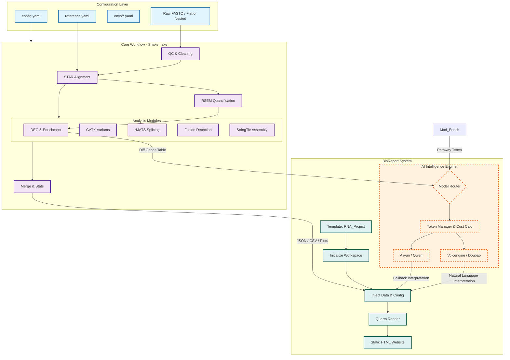
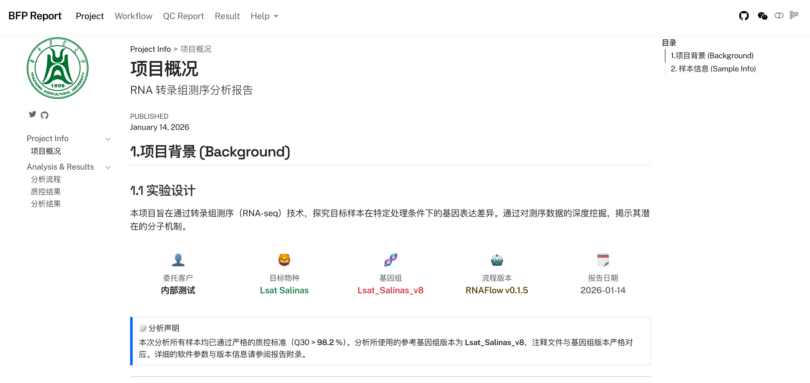
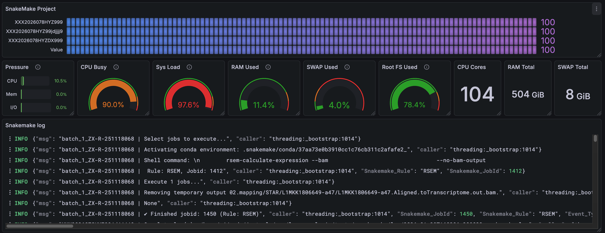

# RNAFlow - RNA-seq Analysis Pipeline

RNAFlow 是一个基于 Snakemake 的全自动化 RNA-seq 分析流程。它实现了从**原始测序数据 (Raw Data)** 到**标准化生物信息报告 (Interactive Report)**，再到 **AI 智能结果解读** 的端到端闭环分析。
> **声明**：RNAFlow 现阶段仅在课题组内部使用，尚未正式对外开源。

## 📖 目录
- [核心特性](#-核心特性)
- [分析工作流](#-分析工作流)
- [系统架构](#-系统架构)
- [BioReport 报告系统](#-bioreport-报告系统)
- [目录结构](#-目录结构)
- [安装指南](#-安装指南)
- [配置指南](#-配置指南)
- [使用说明](#-使用说明)
- [开发计划](#-开发计划)
- [版本历史](#-版本历史)

## ✨ 核心特性

- **高可扩展性 (High Scalability)**：支持分布式任务调度，完美适配集群环境（如 Slurm, PBS），实现大规模样本并行处理。
- **可迁移性 (Portability)**：通过 Conda/Mamba 自动管理所有工具链，实现代码与环境的完全一致，确保分析的可复现性与"无痛"迁移。
- **模块化设计 (Modularity)**：基于 Snakemake 规则，各分析环节（QC、比对、差异分析等）逻辑解耦，便于定制化组合与二次开发。
- **高度透明 (Transparency)**：内置全流程 MD5 校验、运行状态监控（Benchmark）与详实的日志系统，确保分析过程可回溯、数据可审计。
- **实时监控 (Real-time Monitoring)**：集成 Loki + Grafana 监控系统，通过定制化插件 `snakemake_logger_plugin_rich_loguru` 实现实时流程监控，支持结构化日志推送与可视化查询。（注：已弃用旧的 Seq 日志监控方案）
- **自动报告 (Automated Reporting)**：基于 Quarto 驱动，自动汇集多维分析结果，生成包含动态图表（Plotly）与交互式表格的专业生物信息学报告。
- **AI 智能解读 (AI-Powered)**：集成生产级 AI 引擎（如豆包、通义千问），自动将复杂的差异基因和富集结果转化为易于理解的生物学洞察。

## 🛠 分析工作流

RNAFlow 涵盖了标准的转录组分析全过程：

1.  **QC & Cleaning**: FastQC 质控 -> fastp 过滤与去接头。
2.  **Contamination Check**: 检测物种污染（FastQ Screen）。
3.  **Mapping**: STAR 高性能比对 -> Qualimap/Samtools 统计 -> Preseq 文库复杂度 / RSeQC 完整性评估。
    *   **STAR 参数优化**:
        *   `--peOverlapNbasesMin 12`: 允许双端 Read 在有 12bp 重叠时进行合并，显著提升短片段文库的比对准确性。
        *   `--peOverlapMMp 0.1`: 允许重叠区域存在 10% 的错配，提高了在有测序误差或 SNP 存在时的合并成功率。
        *   `--twopassMode Basic`: 开启两轮比对模式，第一轮发现的剪接位点会用于指导第二轮比对，极大提升了拼接位点（Junctions）的识别精度。
        *   `--outFilterMismatchNoverLmax 0.04`: 将错配率限制在 4% 以内（150bp 仅允许 6 个错配），比默认的 30% 严格得多，有效减少假阳性比对。
        *   `--alignMatesGapMax 1000000`: 允许双端 Read 之间存在长达 1Mb 的间隙，这是识别真核生物长内含子所必需的。
        *   `--chimSegmentMin 12`: 设定最小段长度为 12bp，使 STAR 能够搜寻并报告跨染色体的融合信号。
        *   `--quantMode TranscriptomeSAM`: 直接生成比对到转录本的 BAM 文件，方便后续使用 RSEM 或 Salmon 进行定量。
4.  **Quantification**: RSEM 基因/转录本水平表达定量。
5.  **Advanced Analysis**:
    *   **DEG**: 基于 DESeq2 的差异表达分析。
    *   **Enrichment**: GO/KEGG 功能富集分析。
    *   **Splicing**: rMATS 可变剪接检测。
    *   **Fusion**: Arriba 融合基因鉴定。
    *   **Variants**: GATK 单核苷酸变异检测。
    *   **Assembly**: StringTie 脚本组装。
6.  **Reporting & Delivery**: 自动汇总 MultiQC，生成 BioReport 交互式报告，并整理交付目录。

## 🏗️ 系统架构 (System Architecture)



### 🔄 核心数据流说明
1.  **输入解析**: `Snakemake` 自动读取 `config.yaml` 并识别输入数据结构。
2.  **核心计算**: 通过 STAR + RSEM 获得表达矩阵，并行触发高级分析模块。
3.  **结果汇聚**: `15.deliver.smk` 将关键结果汇总到交付目录。
4.  **智能报告**: `BioReport` 系统提取分析结果并调用 AI 引擎进行生物学解读，最终生成 `Quarto HTML` 报告。

## 📊 BioReport 报告系统

位于 `report/` 目录下的 **BioReport** 是本流程的核心亮点：

> [!WARNING]
> **测试说明**：AI 智能解读模块目前仍处于内部测试阶段，尚未整合至最终生成的标准化报告中。

*   **架构理念**：采用 "Copy-Inject-Render" 模式，将分析结果动态注入 Quarto 模板。
*   **AI 引擎**：
    *   **多云架构**：支持火山引擎 (Doubao) 和阿里云 (Qwen)。
    *   **高可用**：支持 API 自动故障切换 (Fallback)。
    *   **成本控制**：内置 Token 统计与截断策略。
*   **交互体验**：报告包含响应式布局、侧边导航以及支持搜索的交互式数据表。

以下为 BioReport 生成的报告示例：



## 📂 项目组织建议 (Project Organization)

为了实现代码与数据的解耦，推荐采用以下三级目录结构来组织分析项目：

### 1. 顶层项目目录
这是项目的根，建议将原始数据、分析过程和最终交付分开：
```text
Project_Root/
├── 00.raw_data/             # 原始下机数据 (只读)
├── 01.workflow/             # 分析工作空间 (运行 Snakemake 的地方)
└── 02.data_deliver/         # 最终结果交付目录 (由流程自动整理生成)
```

### 2. 分析工作目录 (01.workflow)
该目录存放配置文件，并作为 Snakemake 运行的当前工作目录：
```text
01.workflow/
├── config.yaml              # 项目配置文件 (指定 reference_path 等)
├── samples.csv              # 样本信息表
├── contrasts.csv            # 差异分析对照表
├── 01.qc/                   # 质控中间结果
├── 02.mapping/              # 比对中间产物 (BAM等)
├── 03.count/                # 定量中间结果
├── 07.AS/                   # 可变剪接分析中间文件
├── logs/                    # 详细运行日志
└── benchmarks/              # 各步骤资源消耗统计
```

### 3. 结果交付目录 (02.data_deliver)
分析完成后，流程会自动将核心结果汇总至此，供最终交付：
```text
02.data_deliver/
├── 00_Raw_Data/             # 原始数据汇总
├── 01_QC/                   # 质控报告 (MultiQC等)
├── 02_Mapping/              # 比对统计报告
├── 03_Expression/           # 表达定量矩阵
├── 05_DEG/                  # 差异表达分析结果
├── 06_Enrichments/          # 功能富集分析图表
├── 07_AS/                   # 可变剪接分析结果
├── Summary/                 # 项目总体汇总统计
├── Analysis_Report/         # 核心产物：最终交互式网页报告入口
├── report_data/             # 网页报告支撑数据
└── delivery_manifest.json   # 交付清单与 MD5 校验
```

## 📂 仓库目录结构 (Codebase)

```text
RNAFlow/
├── snakefile                # Snakemake 主入口文件
├── config/                  # 配置文件目录 (运行参数、参考基因组)
├── rules/                   # 模块化规则定义 (00-15)
│   ├── 04.short_read_qc.smk # 质控
│   ├── 07.mapping.smk      # 比对
│   ├── 11.DEG_Enrichments.smk # 差异分析与富集
│   ├── 15.deliver.smk      # 结果整理
│   └── ...
├── envs/                    # Conda 环境定义文件 (YAML)
├── report/                  # BioReport 报告系统源码
│   ├── bioreport/           # 报告生成核心逻辑
│   ├── templates/           # Quarto 报告模板
│   └── ai/                  # AI 解读引擎
├── src/                     # 辅助脚本库 (Python/R)
│   ├── DEG/                 # 差异分析相关脚本
│   └── Enrichments/         # 富集分析封装
└── scripts/                 # 实用工具脚本
```

## 🚀 安装指南

1.  **克隆仓库**：
    > [!IMPORTANT] 
    > **声明**：RNAFlow 现阶段仅在课题组内部使用，尚未正式对外开源。
    ```bash
    git clone --recurse-submodules git@github.com:xsx123123/RNAFlow.git
    cd RNAFlow
    ```

2.  **环境准备**：
    安装 Snakemake 和 Mamba：
    ```bash
    conda install -c conda-forge -c bioconda snakemake mamba
    ```

3. The pipeline uses conda environments for dependencies, which will be automatically created during execution.

4. **(Required for Monitoring) Install Enhanced Logger Plugin**:
   To enable beautiful console output, structured logging, and monitoring capabilities (as seen in the Usage examples), install the `snakemake_logger_plugin_rich_loguru` plugin (version 0.1.4):
   ```bash
   pip install snakemake_logger_plugin_rich_loguru==0.1.4
   ```
   > [!NOTE]
   > **Note**: This plugin is currently for internal use only and has not been publicly released.

## ⚙️ 配置指南 (Configuration)

推荐使用外部 YAML 配置文件来管理项目参数，以实现代码与配置的解耦。

### 1. 配置文件示例 (config.yaml)
```yaml
project_name: 'PRJNA1224991'   # 项目 ID
Genome_Version: "Lsat_Salinas_v11" # 基因组版本 (支持: Lsat_Salinas_v8, Lsat_Salinas_v11, ITAG4.1, GRCm39 等)
species: 'Lsat Salinas'        # 分析物种
client: 'Internal_Test'        # 客户 ID

# 原始数据路径 (支持列表，可包含多个目录)
raw_data_path:
  - /path/to/raw_data

# 关键信息表
sample_csv: /path/to/samples.csv    # 样本信息表 (格式见下文)
paired_csv: /path/to/contrasts.csv  # 样本配对/对照信息表 (格式见下文)

# 路径设置
workflow: /path/to/analysis_dir     # 数据分析过程目录 (工作空间)
data_deliver: /path/to/deliver_dir  # 最终结果交付目录

# 运行参数
execution_mode: local               # 运行模式: local 或 cluster
# queue_id: fat_x86                 # 集群队列名称 (仅 cluster 模式有效),如果不在集群运行请移除该配置

# 测序文库设置
Library_Types: fr-firststrand       # 链特异性类型 (fr-unstranded, fr-firststrand, fr-secondstrand)
                                    # 流程会自动检测并对比设置，若不符将发出警告

# 高级分析开关
call_variant: true                  # 是否进行变异检测 (GATK)
noval_Transcripts: true             # 是否进行新转录本组装 (StringTie)
rmats: true                         # 是否进行可变剪接分析 (rMATS)

# 可选配置
only_qc: true                       # 运行模式: qc_only (仅质控)

# 监控配置
loki_url: "http://122.205.67.97:3100"  # Loki 服务器地址 (用于流程监控)
```

### 2. 样本信息表 (sample_csv)
CSV 格式，包含 `sample` (原始文件名关键字), `sample_name` (重命名后的名称), `group` (分组) 三列：
```csv
sample,sample_name,group
L1MKL2302060-CKX2_23_15_1,CKX2_1,CKX2
L1MKL2302061-CKX2_23_15_2,CKX2_2,CKX2
L1MKL2302062-CKX2_23_15_3,CKX2_3,CKX2
L1MKL2302063-Wo408_1,Wo408_1,Wo408
L1MKL2302064-Wo408_2,Wo408_2,Wo408
L1MKL2302065-Wo408_3,Wo408_3,Wo408
```

### 3. 样本配对信息表 (paired_csv)
用于差异分析 (DEG) 的对照设置，包含 `Control` 和 `Treat` 两列：
```csv
Control,Treat
Wo408,CKX2
```

### 4. 流程核心配置文件 (Internal Configs)
除了外部指定的项目配置文件，`config/` 目录下包含了流程运行的默认设置：
- **`config/config.yaml`**: 流程的基础全局配置。
- **`config/reference.yaml`**: 核心参考基因组配置文件。定义了各版本（V8, V11, GRCm39等）的 FASTA、GTF 及索引路径。
  - **流程迁移**：若在不同环境运行，需修改 `reference_path`（例如：`reference_path: /data/jzhang/reference/RNAFlow_reference`）。
  - **新增基因组**：如需支持新物种，请在此文件中按格式添加配置。
  - **自动检查**：流程启动后会自动对参考文件完整性进行 Check，确保分析可靠。
  - **FastQ Screen 数据库**：新增配置 `fastq_screen_db_path`，指向污染源数据库根目录（需包含 hg38, GRCm39, fastq_screen_database 等子目录）。迁移时只需拷贝该目录并在配置中更新路径即可，无需修改代码。
- **`config/run_parameter.yaml`**: 工具运行参数设置，包括各软件的具体命令行参数（如 STAR 的比对阈值、RSEM 的模型参数等）。
  - **STAR 参数详解**:
    - `--peOverlapNbasesMin 12` (当前配置) vs `0` (默认参数): 开启 PE Overlap 合并：允许双端 Read 在有 12bp 重叠时进行合并，显著提升短片段文库的比对准确性。
    - `--peOverlapMMp 0.1` (当前配置) vs `0.01` (默认参数): 放宽合并错配容忍度：允许重叠区域存在 10% 的错配，提高了在有测序误差或 SNP 存在时的合并成功率。
    - `--twopassMode Basic` (当前配置) vs `None` (默认参数): 开启两轮比对模式：第一轮发现的剪接位点会用于指导第二轮比对，极大提升了拼接位点（Junctions）的识别精度。
    - `--outFilterMismatchNoverLmax 0.04` (当前配置) vs `0.3` (默认参数): 强化错配过滤：将错配率限制在 4% 以内（150bp 仅允许 6 个错配），比默认的 30% 严格得多，有效减少假阳性比对。
    - `--alignMatesGapMax 1000000` (当前配置) vs `0` (取决于模式) (默认参数): 开启跨内含子长间隙比对：允许双端 Read 之间存在长达 1Mb 的间隙，这是识别真核生物长内含子所必需的。
    - `--chimSegmentMin 12` (当前配置) vs `0` (默认参数): 开启嵌合体/融合基因检测：设定最小段长度为 12bp，使 STAR 能够搜寻并报告跨染色体的融合信号。
    - `--quantMode TranscriptomeSAM` (当前配置) vs `None` (默认参数): 开启转录组定量输出：直接生成比对到转录本的 BAM 文件，方便后续使用 RSEM 或 Salmon 进行定量。
- **`config/cluster_config.yaml`**: 集群资源定义，规定了不同任务（Low, Medium, High resource）对应的线程和内存分配。

### 5. Loki + Grafana 监控配置 (可选)
RNAFlow 支持通过 Loki + Grafana 进行实时流程监控，所有日志将被结构化推送至 Loki 服务器并通过 Grafana 进行可视化展示：

- **配置参数**：
  - 在 `config.yaml` 中添加 `loki_url` 字段，指定 Loki 服务器地址：
    ```yaml
    loki_url: "http://122.205.67.97:3100"  # Loki 服务器地址
    ```

- **使用方法**：在运行 Snakemake 时添加 `--logger rich-loguru` 参数以启用日志插件：
  ```bash
  snakemake --cores 60 --use-conda --conda-frontend mamba \
            --logger rich-loguru \
            --config analysisyaml=path/to/your_config.yaml
  ```

- **查看监控**：在 Grafana 中可通过以下方式进行日志查询和监控：
  - 访问 Grafana 界面并导入预设的监控面板
  - 查看以下示例截图了解监控效果：



> [!NOTE]
> **Note**: 此监控功能需要安装 `snakemake_logger_plugin_rich_loguru` 插件 0.1.4 版本。

### 6. 集群配置 (可选)
如果 `execution_mode` 设置为 `cluster`，请确保已安装相关集群插件（如 `snakemake-executor-plugin-slurm`）。更细致的资源分配（线程、内存）可编辑 `config/cluster_config.yaml`。

## 💻 使用说明

### 标准分析流程
建议使用外部配置文件以保持项目整洁：

```bash
# 1. 预运行检查 (Dry Run)
snakemake -n --config analysisyaml=path/to/your_config.yaml

# 2. 执行分析 (使用 60 核心，启用 Conda)
snakemake --cores 60 --use-conda --conda-frontend mamba \
          --logger rich-loguru \
          --config analysisyaml=path/to/your_config.yaml
```

### 生成 AI 报告 (BioReport)

`RNAFlow` 实现了分析与报告的深度集成。报告生成任务已内置于 `15.Report.smk` 规则中，在主分析流程完成后会**自动触发**渲染逻辑。

#### 1. 自动集成模式 (推荐)
当您运行标准的分析指令时，流程会自动收集所有模块的结果并调用 BioReport 生成最终 HTML 报告：
```bash
# 运行完整流程，报告将自动生成在 data_deliver/Analysis_Report 目录
snakemake --cores 60 --use-conda --config analysisyaml=config.yaml
```

#### 2. 独立运行模式 (模块化调用)
报告模块也可以作为独立工具使用，便于在已有数据的基础上重新渲染或进行 AI 解读。建议使用 Docker 镜像以避免环境配置问题：

> [!NOTE]
> **注意**：Docker 镜像目前仅供内部使用。如需获取镜像或了解更多信息，请联系开发者。

```bash
docker run -it --rm \
  --user $(id -u):$(id -g) \
  -v /path/to/analysis_data:/data:rw \
  -v /path/to/project_summary.json:/app/project_summary.json:rw \
  -v /path/to/output_report:/workspace:rw \
  bioreportrna:v0.0.5
```
**参数说明：**
- `-v ...:/data`: 挂载上游分析生成的数据目录。
- `-v ...:/app/project_summary.json`: 挂载项目汇总配置文件。
- `-v ...:/workspace`: 挂载报告输出目录。

#### 3. 命令行手动生成
若已在本地配置好环境，也可进入 `report` 目录直接运行：
```bash
python report/bioreport/main.py --input results_dir --output report_dir --ai
```

## 📅 开发计划 (Roadmap)

### v0.1.8 迭代目标 (Target Features for v0.1.8)
- **深度富集分析 (Deep Enrichment Analysis)**:
    - 引入 **GSEA (Gene Set Enrichment Analysis)**，不再依赖 p-value 阈值，基于全基因排序发现微弱但协同变化的通路信号。
    - 增加 **KEGG Pathway** 分析，提供通路图的可视化。
- **QC 增强 (QC Enhancement)**:
    - [已实现] 引入 **RSeQC TIN (Transcript Integrity Number)**，更精准评估 RNA 降解程度 (3' bias)。
- **交互性升级**:
    - 升级 MultiQC 报告，整合更多自定义内容（如 Top DEG 列表、富集气泡图）。

### v0.1.9 迭代目标 (Target Features for v0.1.9)
- **WGCNA (加权基因共表达网络分析)**: 
    - 实现基因模块聚类与表型关联分析，识别核心 Hub Gene。
    - 导出网络文件，支持 Cytoscape 可视化。
- **GSVA (基因集变异分析)**: 
    - 为每个样本计算通路活性分数，实现通路的差异化分析与可视化（热图/相关性）。
- **TF 调控网络预测 (Transcription Factor)**:
    - 针对植物（莴苣等）集成 **PlantRegMap / PlantTFDB**，预测差异基因的上游转录因子调控逻辑。
- **细胞组分去卷积 (Deconvolution)**:
    - 引入 CIBERSORTx/MuSiC 算法，利用单细胞参考集解析组织样本中的细胞类型比例。

### v0.2.0 迭代目标 (Target Features for v0.2.0)
- **LncRNA 预测与分析**:
    - 集成 CPAT/CPC2/LncFinder，鉴定新 LncRNA 并构建 LncRNA-mRNA 共表达网络。
- **云原生参考基因组管理 (Cloud-Native Reference Management)**:
    - 采用 **BYOC (Bring Your Own Cloud)** 策略，赋能用户构建属于自己的生物数据中心，实现"无状态迁移" (Stateless Portability)。
    - **Reference Factory**: 提供独立的 Snakemake 构建流程，支持自动同步至 S3/OSS/MinIO。

### 高级差异分析模块 (Advanced Experimental Design)
- 为了支持更复杂的生物学实验设计（如时间序列分析、双因素交互作用），计划重构 DEG 模块，支持自定义设计公式 (`design_formula`)。

### AI 引擎增强 (AI Engine Enhancement)
进一步提升 AI 在生物信息学分析中的应用能力：

1.  **多模态分析**：结合基因表达、变异、剪接等多种数据类型，提供综合性的生物学解释。
2.  **实时学习**：引入在线学习机制，使 AI 模型能够根据最新文献不断更新知识库。
3.  **个性化解读**：根据用户的专业背景和研究兴趣，定制化生成分析报告内容。

## 📈 版本历史

### RNAFlow_v0.1.8
- **Feature**: 弃用旧的 Seq 日志监控方案，更新为 Loki + Grafana 监控系统。
- **Feature**: 增加`loki_url`配置项，用于配置 Loki 服务器地址以实现流程监控。
- **Feature**: 更新`snakemake_logger_plugin_rich_loguru`插件至 0.1.4 版本，支持 Loki 日志推送。
- **Documentation**: 添加 Grafana 监控示例截图 (见 `doc/grafana.png`)。
- **Feature**: 增加`compress_bg`分析模块，用于`star`对比结果 `covrage` 文件压缩，节省存储空间。


### RNAFlow_v0.1.7
- **Feature**: 增加`estimate_library_complexity`rule，用于评估文库复杂度。
- **Feature**: 增加`rmats_summary`功能，用于合并配对和单独样本的AS分析结果。
- **Improvement**: 使用`temp()`将分析过程`bam`文件标记为分析完成后移除，同时添加`bam2cram`rule,减少分析流程存储开销。
- **Feature**: 增加`CIRCexplorer2_run`功能，用于`circularRNA`检测。
- **Feature**: 增加`geneBody_coverage`功能，用于文库基因覆盖率检测。
- **Feature**: 增加`read_distribution`功能，用于文库read发布检测。
- **Feature**: 使用定制化插件`snakemake_logger_plugin_rich_loguru`结合`seq`实现对于分析流程的监控。通过使用定制化插件实现了分析流程的监控,如果想要实现这个操作,需要自行搭建seq监控,同时修改config文件中的seq_server_url: "http://<ip>:<port>" # seqserver api 配置,同时最终推送到seq的信息可以使用Project = 'MySnakemakePipeline'的形式进行查询,同时注意推送到seq的project_id汇总后面添加时间后缀,已进行区分。

### RNAFlow_v0.1.6
- **Feature**: 模块化重构 `DataDeliver` 函数，提高代码可维护性。
- **Feature**: 增强配置验证机制，提升错误提示准确性。
- **Improvement**: 优化 AI 报告生成流程，支持更多输出格式。
- **Feature**: 深度集成 **BioReport v2** 报告系统。
- **Feature**: 增加规则 `14.Merge_qc` 和 `15.deliver`，实现全流程结果自动化整理。
- **Feature**: 新增 **Execution Mode** 切换功能 (`run_mode: qc_only`)，支持快速执行质控与比对，便于大规模数据初筛。
- **Improvement**: 更新 `11.DEG_Enrichments`，整合富集分析逻辑。
- **Optimization**: 完善 AI 解读引擎的流控与容错机制。


### RNAFlow_v0.1.5 (2026-01-11)
- **新特性**: 实现了智能输入数据识别。流程现在可以自动检测样本文件是按目录组织还是作为扁平文件存储在公共目录中，简化了样本表的准备工作。
- **改进**: 通过集成 `rich-loguru` 增强了 CLI 输出体验，提供更好的日志记录和错误报告。
- **文档**: 更新了目录结构和使用示例。

### RNAFlow_v0.1.4 (2026-01-07)
- 添加 rMATS 分析用于可变剪接检测
- 添加基因融合检测模块
- 添加富集分析功能
- 添加对 GRCm39 参考基因组的支持
- 修复并更新 rMATS 规则 (12.rMATS.smk)
- 修复工作流程源路径问题

### RNAFlow_v0.1.3 (2026-01-03)
- 添加差异表达分析 (DEG) 模块
- 添加合并 RSEM 功能
- 更新 RSEM 工作流程
- 添加转录本组装 (StringTie) 模块
- 添加变异检测 (GATK) 模块
- 各种错误修复和改进

### RNAFlow_v0.1.2 (2025-12-25)
- 修复比对模块错误 (07.mapping.smk)

### RNAFlow_v0.1.1 (2025-12-24)
- 添加 RSEM 定量模块 (08.rsem.smk)

### RNAFlow_v0.1 (2025-12-24)
- 初始发布
- 基础 RNA-seq 分析工作流程
- 质量控制、比对和定量模块

---
**Author**: JZHANG | **Version**: RNAFlow_v0.1.8
