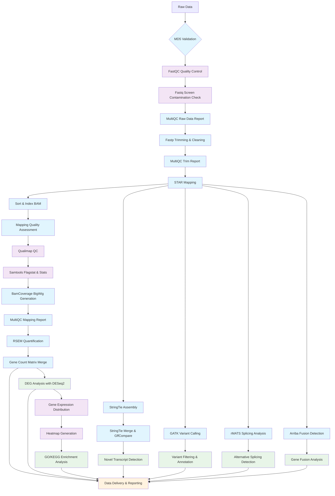

# RNAFlow Pipeline Flowchart

```mermaid
graph TD
    A[Raw Data] --> B{MD5 Validation}
    B --> C[FastQC Quality Control]
    C --> D[Fastq Screen Contamination Check]
    D --> E[MultiQC Raw Data Report]
    E --> F[Fastp Trimming & Cleaning]
    F --> G[MultiQC Trim Report]
    G --> H[STAR Mapping]
    H --> I[Sort & Index BAM]
    I --> J[Mapping Quality Assessment]
    J --> K[Qualimap QC]
    K --> L[Samtools Flagstat & Stats]
    L --> M[BamCoverage BigWig Generation]
    M --> N[MultiQC Mapping Report]
    N --> O[RSEM Quantification]
    O --> P[Gene Count Matrix Merge]
    P --> Q[DEG Analysis with DESeq2]
    Q --> R[Gene Expression Distribution]
    R --> S[Heatmap Generation]
    S --> T[GO/KEGG Enrichment Analysis]
    
    %% Alternative paths
    H --> U[StringTie Assembly]
    U --> V[StringTie Merge & GffCompare]
    V --> W[Novel Transcript Detection]
    
    H --> X[GATK Variant Calling]
    X --> Y[Variant Filtering & Annotation]
    
    H --> Z[rMATS Splicing Analysis]
    Z --> AA[Alternative Splicing Detection]
    
    H --> AB[Arriba Fusion Detection]
    AB --> AC[Gene Fusion Analysis]
    
    %% Final delivery
    P --> AD[Data Delivery & Reporting]
    Q --> AD
    T --> AD
    W --> AD
    Y --> AD
    AA --> AD
    AC --> AD
    
    %% Styling
    classDef processData fill:#e1f5fe
    classDef qcProcess fill:#f3e5f5
    classDef analysisProcess fill:#e8f5e8
    classDef deliveryProcess fill:#fff3e0
    
    class B,C,D,E,F,G,H,I,J,K,L,M,N,O,P,Q,R,S,T,U,V,W,X,Y,Z,AA,AB,AC,AD processData
    class C,D,K,L,R,S qcProcess
    class Q,T,W,Y,AA,AC analysisProcess
    class AD deliveryProcess
```